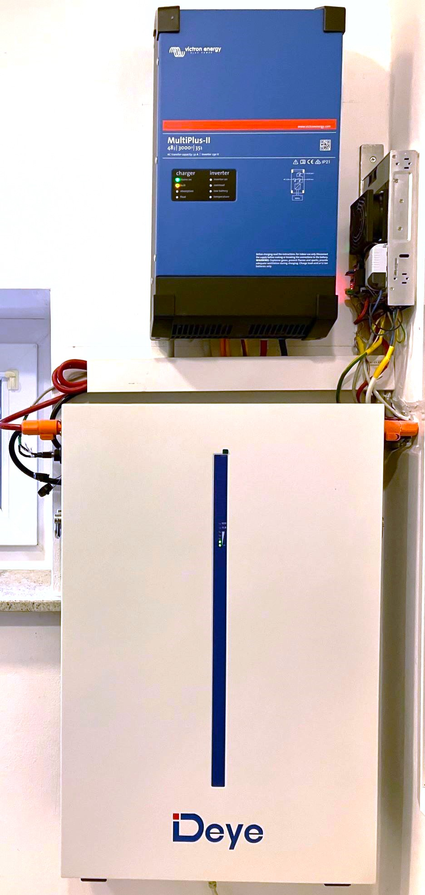

# My 48VDC system
This repository gives an overview of my 48VDC system and serves as a collection point for interesting information about the components of my system.

## System overview

The mainly important components of this system are:
  - VICTRON MultiPlus-II 48-3000-35 inverter
  - DEYE RW-M6.1 Battery
  - MEANWELL RSP-500-48 power supply (sligthly modified and enhanced)

I use these components to create a telecommunication like 48VDC system at my home. Due to a relatively new building, i installed 2014 a couple of additionaly cables between my power distribution units in each floor and can thereby good distribute the power to the required loads.
These loads are my automation units (for example KNX and DALI devices), network switches, router, PoE devices, but also my whole LED lighting in ground floor.
Initially 4 old lead-acid car batteries were the "core" of my system and my modified [500 Watt MEANWELL power supply](./datasheets/MeanWell_RSP-500-spec.pdf) was my intelligent charger for this system.

I monitored this system using GRAFANA and observed the balancing between the 4 batteries.
Due to slightly load (I did not connected lighting initially) and very powerful China balancers I could compensate one of 4 batteries completely and thus I have time to find the next old battery for my system.
But lead-acid batteries and mainly old car batteries do not have enough residal capacity. Finaly I changed almost every month at least one battery from this lead-acid system and the whole work was very laborious.   
Since October 2023 I replaced my old lead-acid system by I nice [DEYE RW-M6.1](./datasheets/DEYE_User_Manual_RW-M6_1_Version_1_2_DE_EN.pdf) battery. Usualy a DEYE battery is operated together with a DEYE inverter. But poor documentation for DEYE products and incompetence of their distributor from Berlin have an impact on my decision for VICTRON inverter.

VICTRON inverters are very good documented and are known from maritime area. Also the using of a Linux based "Venus OS" and posibility to use of a "Raspberry Pi" as control unit for the inverter are essential "pro" factors for this product.
The [MultiPlus-II](./datasheets/Datasheet-MultiPlus-II-inverter-charger-EN.pdf) inverter can rudimentary monitor, charge and discharge the RW-M6.1 battery, but this battery will not detected correctly from the native CAN driver of "Venus OS". For this reason, since December 2024 I started looking for an alternative and practicable solution and found a Python project ["venus-os_dbus-serialbattery"](https://github.com/mr-manuel/venus-os_dbus-serialbattery/tree/master) that allows support for additionaly batteries, which are not supported natively by "Venus OS".
["venus-os_dbus-serialbattery"](https://github.com/mr-manuel/venus-os_dbus-serialbattery/tree/master) was initially created to support the batteries over serial communication (UART, RS485), but last years this project was enhanced by support for CAN communication. Also two different BMS/Battery types are actually implemented as Python scripts and can serve as a good template for similar projects.
I am not a professional programmer and Python is really the badest programming language, which I know, but I did not a really alternative, as to write my own Python based "driver" for DEYE battery under "Venus OS".

## Reverse engineering
As described above, DEYE batteries are very poor documented. It was very difficult for me to find any documentation in internet about the protocols for all the interfaces, which DEYE RM-M6.1 have. And it has really a lot of interfaces:
  - RS485 to the inverter (No, that is no MODBUS, but proprietary)
  - PCSCAN to the inverter for required communication between BMS and inverter
  - RS485 to further batteries in parallel
  - serial to further batteries in parallel (I do not know the details)
  - INTERCAN to further batteries in parallel

And to all these interfaces you will not find an official documentation in the internet. Allegedly PCSCAN can be configured to support different "dialects", such as Pylontech or Victron. However, my practical experiments have shown that this is unfortunately not the case in reality.
But after an intensive recherche I found two users an GITHUB, who are familiar with this topic: [Psynosaur from South Africa](https://github.com/Psynosaur) and [Adminius from Germany](https://github.com/Adminius). Adminius found a more or less good [documentation about the PCSCAN communication](./CAN/PCSCAN/PCS_CAN-Bus-protocol-DY-low-voltage_V3.3.zh-CN.en-1.pdf) and translated it from Mandarin to English. Furthermore he write the first PCSCAN implementation as an [yaml script](https://github.com/Adminius/esphome-yaml-collection/blob/main/deye_rw-m6.1.yaml) within his [esphome-yaml-collection](https://github.com/Adminius/esphome-yaml-collection).
Psynosaur worked parallel and independed from Adminius on the INTERCAN. Psynosaur started his investigations with [reverse engineering on serial interface](https://github.com/Psynosaur/Deye_Battery_Serial_BUS) of DEYE batteries and completed his work with a solution, which was very compatible to ESPHOME project of Adminius. Finally Adminius gave its PCSCAN code to Psynosaur and Psynosaur merged it in its [esphome-deye-bms](https://github.com/Psynosaur/esphome-deye-bms) project. In his repository we can find also the [documentation](https://github.com/Psynosaur/esphome-deye-bms/blob/main/InterCAN%20parameters%20address%20table.xlsx) to the [INTERCAN protocol](./CAN/INTERCAN/InterCAN_parameters_address_table.pdf) as result of his reverse engineering experiments.
